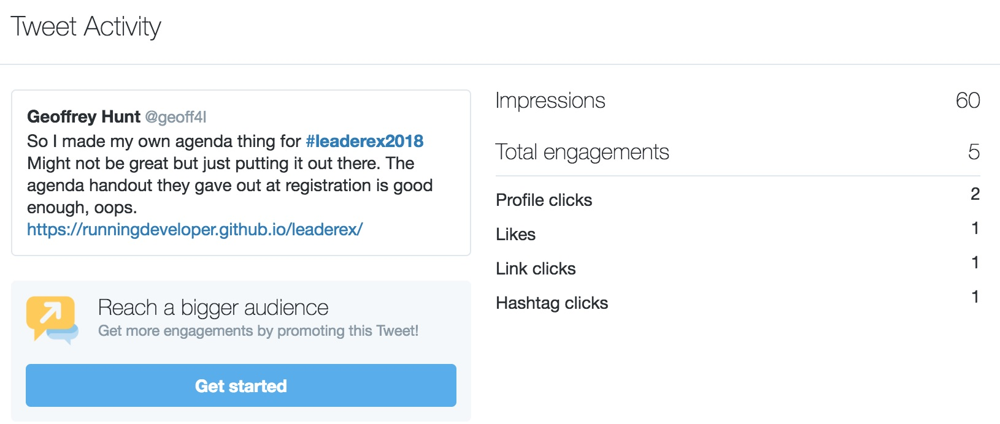
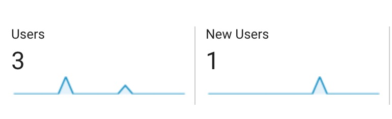

# Update 5 Sep 2018

- So this was a bit of a fail (doubt anyone will read this so just putting this out)
- It worked for me on the day but no one else saw it
- I sent out a tweet kind of hoping people would see it considering I added the event hashtag. But I think I also probably didn't really want anyone to see it. I'm stuggling to show people my work, I'm scared. During the event I saw some people I know and didn't even say 'Hey check out this thing I made'. Oh well I'm learning LOL.
- Check the twitter and analytics below. Got 1 person to the website on the day (other 2 was me, laptop and phone)

## Original 3 Sep 2018:

# Leaderex Agenda (Unofficial)

[website link](https://runningdeveloper.github.io/leaderex/)

## What

I wanted to plan the sessions I would attend at a conference called [Leaderex](http://www.leaderex.com/), but I didn't find the agenda on the website very user friendly. So I thought I could make it the way I would like it:
- Place with all the sessions in time order
- Some filtering to make it easier to find talks
- Something quick and easy to save the sessions I want to go to (NB, this is just local storage so per device)

**This was super quick so I'm sure there will be bugs and spelling mistakes, use at own risk**

## Code

There are 2 folders:
- scrape - where I scrape the agenda using puppeteer 
- website - using gastbyjs that pulls in the agenda data from the scraping script

Not sure if this was the bes solution. But it kind of works.

 *This was super quick so I'm sure there will be bugs and spelling mistakes, use at own risk